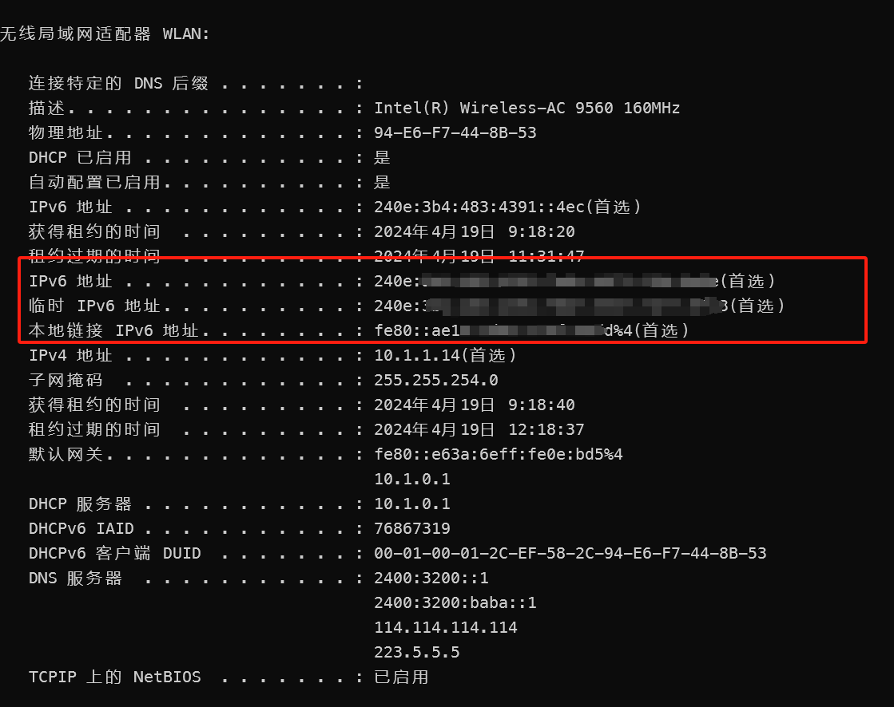

**关于DDNS-go，多个IPV6的绑定的使用方式**

本教程主要针对VPS或主机下拥有多个IPV6地址，绑定同一域名或者不同域名的场景。

以下以新建虚拟机做演示：

1. 通过首页的wiki文档安装ddns-go，并进入管理页面。
1. 以Cloudflare为例：在DNS服务商内选择对应的服务商，并在下方的地方回填token，usename、password、key等相关信息。

3.在IPV6部分：勾选 启用 并在下方选择 通过网卡获取，正则表达式处回填 @1 代表使用网卡内的第一IPV6地址，如不清楚第一个V6地址是什么可使用命令查询；

linux使用ip a命令查询：

注意：不要选择fe80开头的v6地址，该类地址为v6的本地链路地址，类似为v4地址中192.168.1.1的私网地址。

Windows在命令行中使用ipconfig/all命令查询：

注意：不要选择fe80开头的v6地址，该类地址为v6的本地链路地址，类似为v4地址中192.168.1.1的私网地址。

关于Donmains绿色部分为自定义传递参数，可参考ddns-go官方提供Wiki，[https://github.com/jeessy2/ddns-go/wiki/%E4%BC%A0%E9%80%92%E8%87%AA%E5%AE%9A%E4%B9%89%E5%8F%82%E6%95%B0]()，上图以CLoudflare为例。

4、添加第二条DNS记录：在管理页面的顶部点击添加，点击后将会新增配置后续重复前面部分的1、2、3步，避免频繁更新IPV4的DNS记录，可以后面的新增的配置将启用IPV4去勾

5、总结，每个V6地址可以绑定相同或者不同的域名，每一条DNS记录需要新增一个配置。

吐槽：因为想偷懒曾尝试直接修改ddns-go.yaml文件，修改完后刷新管理页面配置并没有生效，只能老老实实在管理页面新增。
