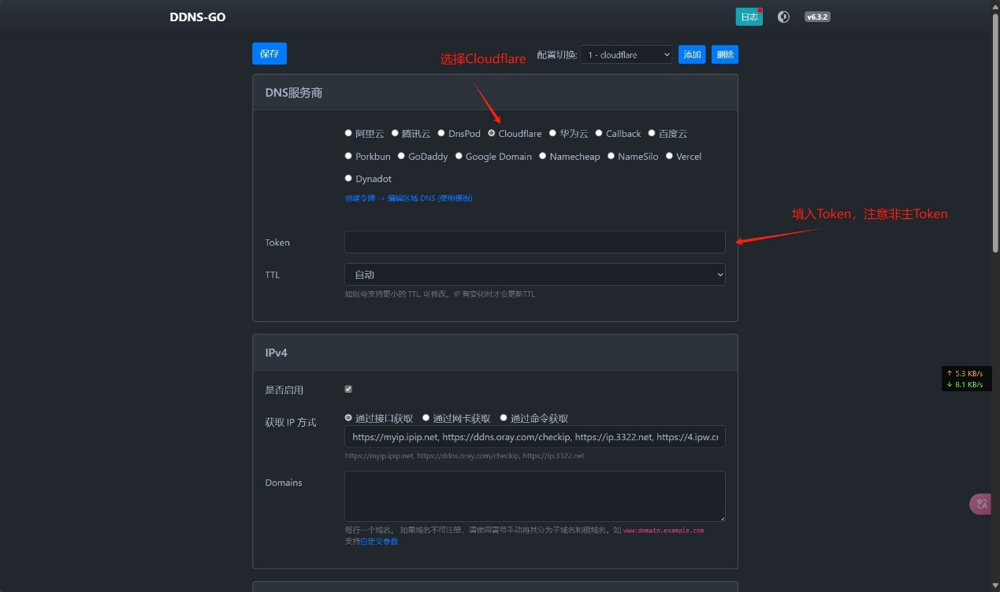
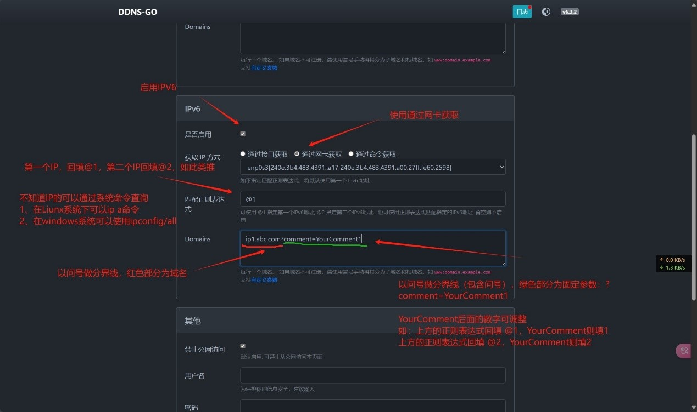
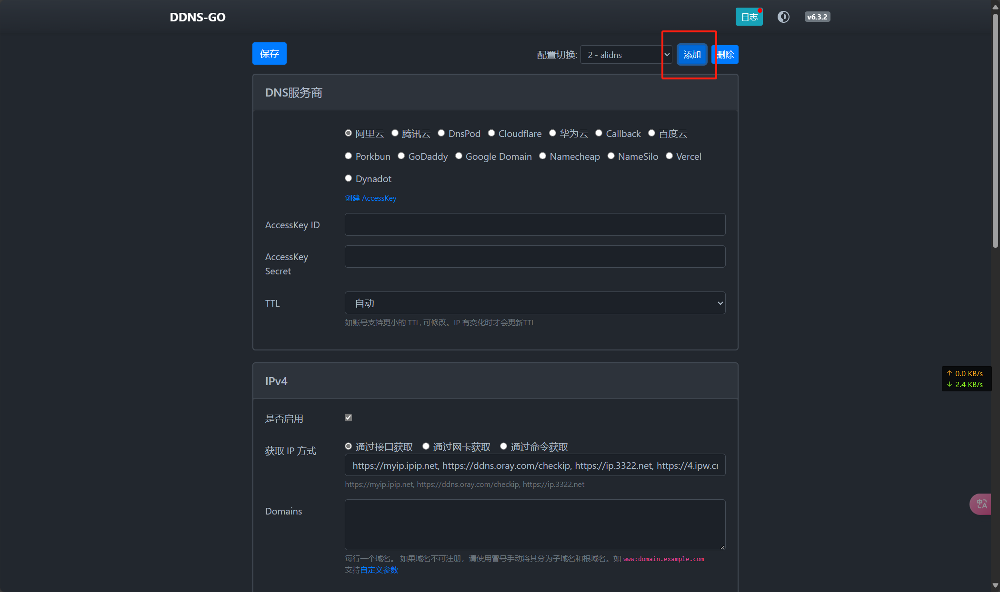

# **关于DDNS-go，多个IPV6的绑定域名的食用指北**

本教程主要针对VPS或主机下拥有多个IPV6地址，绑定同一域名或者不同域名的场景。

以下以新建虚拟机做演示：

## 1. 通过DDNS-GO官方的README文档安装ddns-go，并进入管理页面。
[DDNS-GO](https://github.com/jeessy2/ddns-go)👈👈👈官方链接

## 2.DNS服务商 ：
以Cloudflare为例：在DNS服务商内选择对应的服务商，并在下方的地方回填**token**，**usename**、**password**、**key**等相关信息。



## 3.在IPV6部分：
勾选 **启用** 并在下方选择 **通过网卡获取**，正则表达式处回填 **@1** 代表使用网卡内的第一IPV6地址

如果不清楚第一个V6地址是什么可使用命令查询：
***
linux使用ip a命令查询：


注意：不要选择**fe80**开头的v6地址，该类地址为v6的本地链路地址，类似为v4地址中**192.168.1.1**的私网地址。
***
Windows在命令行中使用ipconfig/all命令查询：


注意：不要选择**fe80**开头的v6地址，该类地址为v6的本地链路地址，类似为v4地址中**192.168.1.1**的私网地址。
***

***
关于Domains绿色部分为自定义传递参数，可参考[ddns-go官方提供Wiki](https://github.com/jeessy2/ddns-go/wiki/%E4%BC%A0%E9%80%92%E8%87%AA%E5%AE%9A%E4%B9%89%E5%8F%82%E6%95%B0)，上图以CLoudflare为例。

图中的 👉👉 ip1.adc.com 👈👈代表为您的域名

图中的 👉👉 ?comment=YourComment1 👈👈 ,👉 ? 👈 后面的部分根据作者[jeessy2](https://github.com/jeessy2)所说理解为DNS记录的备注，可自定义但同一域名下需要唯一，我的做法是：当正则表达式填写 **@2** 时， 则**?comment=YourComment2**。（注意：第一个IPV6不用写自定义参数，直接写域名即可，写了日志会报错）

示例：如果正向表达式填写 **@2** 的时候，**Domains**部分填写
````
ip2.abc.com?comment=YourComment2
````

## 4.添加第二条DNS记录：

添加第二条DNS记录：在管理页面的顶部点击添加，点击后将会新增配置后续重复前面部分的1、2、3步，为避免频繁更新IPV4的DNS记录，可以后面的新增的配置将启用IPV4去勾



## 5.总结：

每个V6地址可以绑定相同或者不同的域名，但每一条DNS记录需要新增一个配置。

## 6.偷懒大法：

如果有多个IPV6需要绑定多条DNS记录，使用管理页面操作相对比较繁琐，则可以考虑直接修改YAML文件。

YAML文件：

````
dnsconf:
    - ipv4: #ipv4部分
        enable: true #勾选启用ipv4=true，反则=false
        gettype: url #使用接口获取=url、使用通过网卡获取=netInterface
        url: https://myip.ipip.net, https://ddns.oray.com/checkip, https://ip.3322.net, https://4.ipw.cn
        netinterface: eth1 #ipv4的网卡，liunx可使用ip a命令查看
        cmd: ""
        domains:
            - ip.abc.com #您的域名
      ipv6: #ipv6部分
        enable: true #勾选启用ipv6=true，反则=false
        gettype: netInterface #使用接口获取=url、使用通过网卡获取=netInterface
        url: https://speed.neu6.edu.cn/getIP.php, https://v6.ident.me, https://6.ipw.cn
        netinterface: eth0 #ipv6的网卡，liunx可使用ip a命令查看
        cmd: ""
        ipv6reg: '' #正则表达式
        domains:
            - ip.abc.com  #您的域名
      dns:
        name: cloudflare #DNS服务商
        id: ""
        secret:  #cloudflare的token
      ttl: ""
user:
    username: #登录管理页面用户名称
    password: #登录管理页面用户密码
webhook:
    webhookurl: ""
    webhookrequestbody: ""
    webhookheaders: ""
notallowwanaccess: false #是否允许外网登录
lang: zh #管理页面的语言
````


感谢作者[jeessy2](https://github.com/jeessy2)的指导
